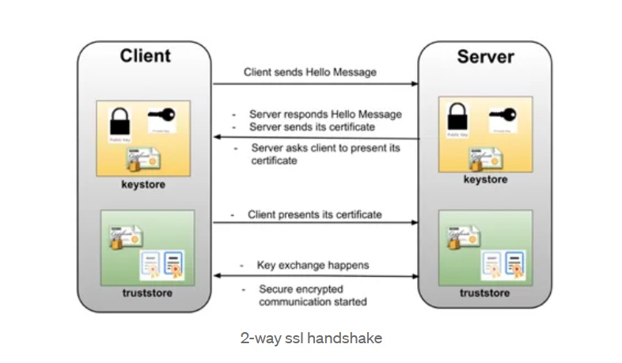

### 2 way SSL with spring boot
- Demo client (nt-gateway) and service (nt-ms) code to show how to get 2 way SSL setup with self signed certificate.

## Architecture
-

## Prerequisites
* Java 11
* Spring boot 2.7.5
* Java keytool utility

##(a) Create A Self Signed Cert:
- We will use key tool command for this. 
- That last part in key tool command is very critical as self signed cert created without SAN entries won’t work with Chrome and Safari.

*Step-1: Client Side (nt-gateway)

```
keytool -genkeypair -alias nt-gateway -keyalg RSA -keysize 2048 -storetype JKS -keystore nt-gateway.jks -validity 3650 -ext SAN=dns:localhost,ip:127.0.0.1 

```
*Step-2: Server Cert (for nt-ms)
```
keytool -genkeypair -alias nt-ms -keyalg RSA -keysize 2048 -storetype JKS -keystore nt-ms.jks -validity 3650 -ext SAN=dns:localhost,ip:127.0.0.1

```

## (b) Create public certificate file:
- We’ve client and server certs created, we need to set up trust between both. To do that, we’ll import client cert in to the server’s trusted certificates and vice versa. But before we can do that, we need to extract public certificate of each jks file.
*Step-3: Client(nt-gateway) Public crt

```
keytool -export -alias nt-gateway -file nt-gateway.crt -keystore nt-gateway.jks 
Enter keystore password:
Certificate stored in file <nt-gateway.crt>

```

*Step-4: Server (nt-ms) Public crt
```
keytool -export -alias nt-ms -file nt-ms.crt -keystore nt-ms.jks
Enter keystore password:
Certificate stored in file <nt-ms.crt>

```

## (c) Import Cert to jks File:
*Step-5: Client Cert to Server side (hit: use server jks password: here nt-service)
```
keytool -import -alias nt-gateway -file nt-gateway.crt -keystore nt-ms.jks

```
*Step-6: Server Cert to Client side 
```
keytool -import -alias nt-ms -file nt-ms.crt -keystore nt-gateway.jks

```

## (d) Configure Server (nt-service) 2 Way SSL: 
*Step-7: Copy final server jks file (eg, nt-ms.jks) to the src/main/resources/ folder of nt-ms application.
*Step-8: Add following in application.yml


```
spring:
  application:
    name: nt-ms
---
server:
  port: 9002
  ssl:
    enabled: true
    client-auth: need
    key-store: classpath:nt-ms.jks
    key-store-password: nt-service
    key-alias: nt-ms
    key-store-type: JKS
    key-store-provider: SUN
    trust-store: classpath:nt-ms.jks
    trust-store-password: nt-service
    trust-store-type: JKS
```


## (e) Configure Client (nt-gateway) for 2 way SSL:
*Step-9: Copy final server jks file (eg, nt-gateway.jks) to the src/main/resources/ folder of nt-ms application.
*Step-10: Add following in application.yml

```
spring:
  application:
    name: nt-gateway
---
server:
  port: 9001
  ssl:
    enabled: true
    client-auth: need
    key-store: classpath:nt-gateway.jks
    key-store-password: nt-gateway
    key-alias: nt-gateway
    key-store-type: JKS
    key-store-provider: SUN
    trust-store: classpath:nt-gateway.jks
    trust-store-password: nt-gateway
    trust-store-type: JKS
---
endpoint:
  ms-service: https://localhost:9002/nt-ms/data
  
```


## (f) Browser as client for API gateway (nt-gateway)
- When we access gateway url in browser, our browser becomes the client to our gateway application and so, our gateway web app will ask the browser to present a cert for authentication.
- NOTE: But our browser can’t understand a .jks file. Instead, it understands PKCS12 format. So, how do we convert .jks file to PKCS12 format.

*Step-11: jks (nt-ms.jks) file to PKCS12
```
keytool -importkeystore -srckeystore nt-ms.jks -destkeystore nt-ms.p12 -srcstoretype JKS -deststoretype PKCS12 -srcstorepass nt-service -deststorepass nt-service -srcalias nt-ms -destalias nt-ms -srckeypass nt-service -destkeypass nt-service -noprompt

```
## Import PKS file in browser:
* To import this .p12 file on mac (you will need to import this on login keychain).
- Open keychain access
- Click on login under “keychains” and “Certificates” under Category
- Drag and drop the .p12 file here. It will prompt for the .p12 file password. Enter it and add.
- Double click the cert you just uploaded and under “Trust” and select the “Always Trust” option. This will ask you for your login keychain password. Enter it and proceed.

* Import .p12 in Windows 
- Please search fo the certificate file (nt-ms.p12) on your computer and execute it with a double mouse click
- Flow Certificate Import Wizard.
- Enter the password you have set when creating the .p12 file.
- Choose "Mark key as exportable" and "Include all extended properties" to be able to generate a .p12 file from the Windows certificate store.
- Choose a certificate store (automatic) then finish 
- Successful Message will be shown.

## Run the both applications & check the application port connects (https)
- nt-gateway (9001)
- nt-ms (9002)

#### Test
- Close your browser windows, open and clear your cookies/cache and then,
- hit https://localhost:9001/nt-gw/ms-data and you will be given a warning for “Connection not private” error.
- Check the certificate
-

